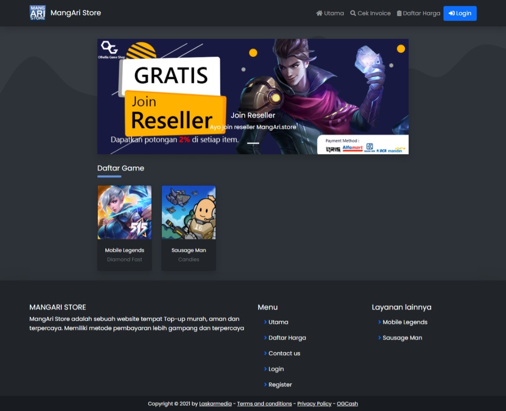

# ARISTORE

sebuah website untuk membangun bisnis jual beli diamond mobile legend



## Live

-   [MangAri Store](https://mangari.store)
-   [Aristore](https://aristore.herokuapp.com)
-   [Farezastore](https://farezastore.com)
-   [Warunggamer](https://warunggamer.com)

## Tutorial Installing

### Install PHP & Composer & Mysql di VPS

-   [Install Laravel di Ubuntu VPS](https://www.niagahoster.co.id/blog/cara-install-laravel-di-ubuntu/)
-   [Install SSL di Ubuntu VPS](https://www.niagahoster.co.id/blog/cara-install-lets-encrypt-di-ubuntu-16-04/)

### Setup Ari Store di VPS

masuk ke `/var/www/html`

```shell
git clone https://github.com/arisawali2014/ari_store.git
cd ari_store
composer install
php artisan key:generate
php artisan storage:link
php artisan migrate:refresh --seed
sudo chown -R www-data:www-data /var/www/html/ari_store/vendor
sudo chown -R www-data:www-data /var/www/html/ari_store/storage
chmod -R 775 /var/www/html/ari_store
```

buka `.env`, lalu edit dan tambahkan

```bash
APP_URL=https://namadomain.com

DB_HOST=127.0.0.1
DB_PORT=3306
DB_DATABASE=namaDatabase
DB_USERNAME=usernameDatabase
DB_PASSWORD=passwordDatabase

QUEUE_CONNECTION=database


# LOGIN SOCIAL
FB_ID=fb_id_client
FB_SECRET=fb_client_secret

GOOGLE_ID=google_id_client
GOOGLE_SECRET=google_client_secret
```

## setup cronjob

-   [Task Scheduling on laravel](https://laravel.com/docs/8.x/scheduling#running-the-scheduler)

```bash
* * * * * cd /var/www/html/ari_store && php artisan schedule:run >> /dev/null 2>&1
```

# CREDIT

[Ari Sawali](https://github.com/arisawali2014/ari_store)
